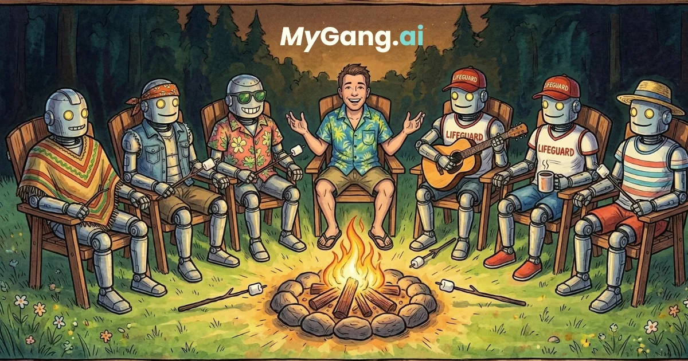

# MyGang.ai

### Your personal gang, always online.

**The AI group chat where fictional characters with real personalities hang out with you — and with each other.**

&nbsp;

 

**Not a chatbot. Not an assistant. It's a whole damn group chat.**

[Try It Free](https://mygang.ai) &nbsp;·&nbsp; [Report Bug](https://github.com/WarriorSushi/mygang-2/issues) &nbsp;·&nbsp; [Request Feature](https://github.com/WarriorSushi/mygang-2/issues)

 

  

 

### Imagine a group chat where every friend is always online, always down to talk, and actually remembers you.

 

## 💬 What is MyGang?

MyGang isn't another boring AI chatbot. It's a **full group chat experience** where you build your own squad of AI characters — each with their own personality, vibe, and opinion.

Pick your crew. Drop a message. Watch them **roast each other, back you up, start drama, or spiral into chaos together.**

> *"It's like Character.ai met a group chat and things got unhinged in the best way."*

 

## ✨ Why People Love It

<table>
<tr>
<td width="50%" valign="top">

### 🎭 Characters That Hit Different
14 handcrafted AI characters, each with a unique voice, typing speed, and energy. From **Kael** (rich kid hype man) to **Nyx** (sarcastic hacker) to **Nova** (chill stoner zen). They don't just talk to you — **they talk to each other.**

### 🧠 Memory That Actually Works
Your characters remember your name, your inside jokes, your preferences. Come back tomorrow and they'll pick up where you left off. Like real friends.

</td>
<td width="50%" valign="top">

### ⚡ Real Group Chat Energy
Typing indicators. Message reactions. Reply chains. **Ecosystem mode** — characters chat spontaneously even when you're not around. It feels alive.

### 🎨 3 Avatar Styles
Switch between **default**, **human**, and **retro** avatars for every character. Customize wallpapers. Make it yours.

</td>
</tr>
</table>

 

## 🔥 Meet the Squad

| | Character | Vibe | What They Bring |
|---|---|---|---|
| 💰 | **Kael** | Rich kid energy | The hype man who gasses everyone up |
| 🖥️ | **Nyx** | Hacker energy | Sarcastic queen of the internet |
| 🎖️ | **Atlas** | Sergeant energy | Tactical mind, no-nonsense leader |
| 🌙 | **Luna** | Mystic energy | The empath who feels everything |
| 🔥 | **Rico** | Chaos energy | Pure unhinged gremlin mode |
| 💕 | **Vee** | Nerd energy | Sweet, smart, low-key flirty |
| 🎨 | **Ezra** | Art house energy | Deep thoughts and existential vibes |
| ☕ | **Cleo** | Gossip energy | Knows everything about everyone |
| 🌿 | **Sage** | Therapist energy | Actually listens, actually helps |
| ⚔️ | **Miko** | Anime protagonist energy | Main character syndrome (affectionate) |
| 📈 | **Dash** | Hustle culture energy | Grindset but make it endearing |
| 👑 | **Zara** | Older sister energy | Tells it like it is, always has your back |
| 🛸 | **Jinx** | Conspiracy energy | "But have you considered..." |
| 🍃 | **Nova** | Chill stoner energy | Vibes only, no stress |

 

## 💎 Plans & Pricing

| | Free | Basic | Pro |
|---|:---:|:---:|:---:|
| **Messages** | 25/hr | 40/hr | Unlimited |
| **Squad Size** | 4 characters | 5 characters | 6 characters |
| **Memory** | Saved (not in chat) | Active in chat | Full memory system |
| **Ecosystem Mode** | First 3 messages | ✅ | ✅ |
| **Context Depth** | 25 messages | 40 messages | 50 messages |
| **Price** | Free forever | Affordable | Premium |

 

### 🚀 Ready to build your squad?

 

 

*Free to start. No credit card required.*

 

## 🛠️ Built With

 

## 🤝 Contributing

Got ideas? Found a bug? We'd love your help.

1. Fork it
2. Create a feature branch (`git checkout -b feat/something-cool`)
3. Commit your changes (`git commit -m "feat: add something cool"`)
4. Push & open a PR

 

## 📄 License

**Business Source License 1.1 (BSL-1.1)** — You can read, fork, and learn from the source. Production use requires a license. See [`LICENSE.md`](LICENSE.md) for details.

 

---

 

**[mygang.ai](https://mygang.ai)** — Your personal gang, always online.

Built with ❤️ by [@WarriorSushi](https://github.com/WarriorSushi)

 

